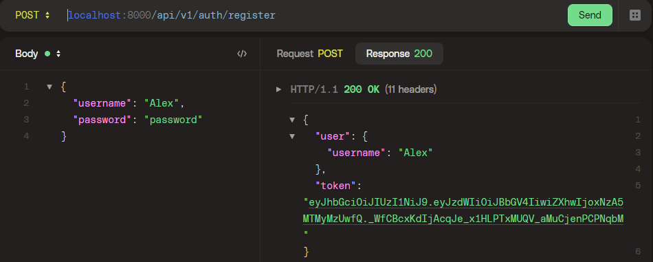
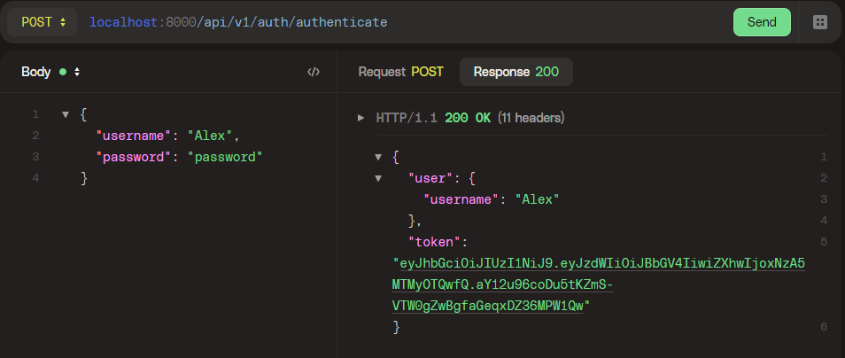
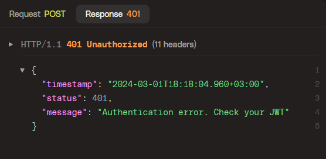
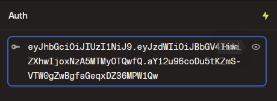
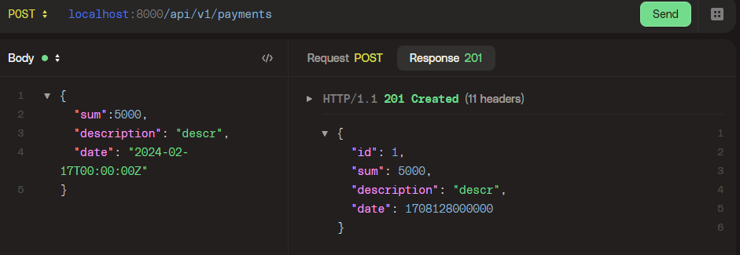
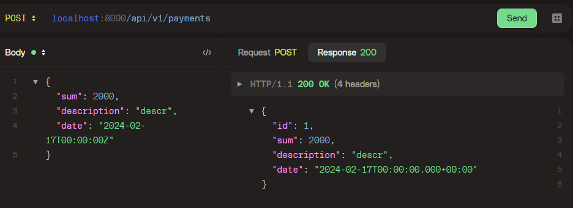
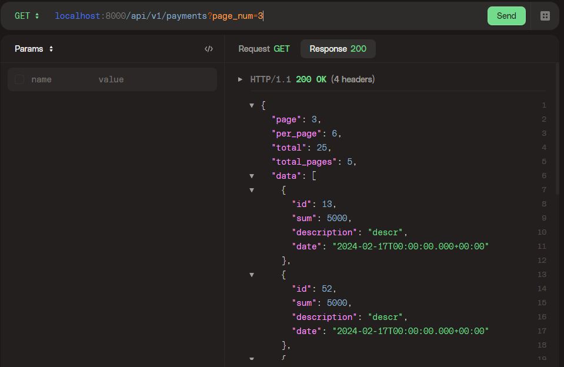
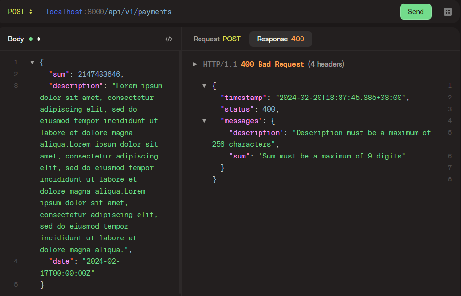
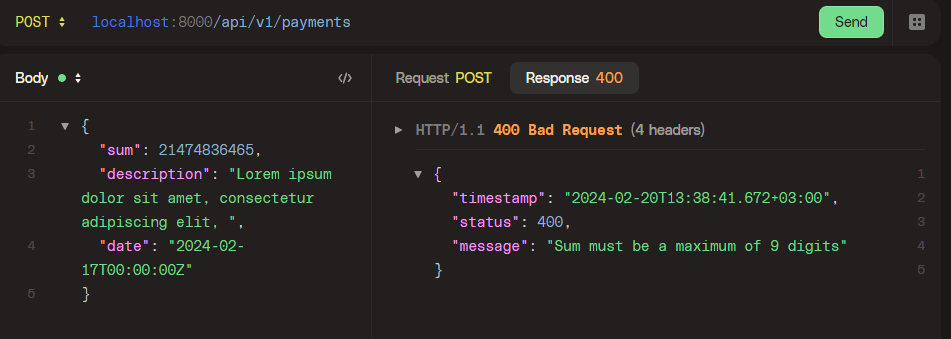

# Simple-Spring-Payment-App
## Запуск приложения
- Необходимо запустить Docker-Desktop
- Создать сеть Docker с именем "SSPA-postgres"
```shell
docker network create sspa-postgress
```
- Запустить docker-compose файл в каталоге проекта
```shell
docker compose up --build
```
- Приложение должно запуститься. Проверить это можно в docker desktop (В разделе Containers рядом с simple-spring-payment-app должен быть зеленый символ)

- Первым делом необходимо авторизироваться. Для этого надо послать POST запрос на адрес `localhost:8000/api/v1/auth/register` с телом:
```json
{
  "username": "username",
  "password": "password"
}
```
- В ответ придет token, который надо вставить в заголовок:
```json
{
  "Authorization": "Bearer token"
}
```
- Его время жизни - час. Через час надо совершнить запрос на `localhost:8000/api/v1/auth/authenticate` с username и password
- Получить доступ к приложению после авторизации можно по адресу `localhost:8000/api/v1/payments`
## Сменить порт
Для смены порта в файле docker-compose.yml изменить services.backend.ports на {желаемый порт}:8000
## База данных
Сейчас Spring работает в режиме обновления. Это значит, что он будет создавать БД один раз, 
затем сохранять ее и использовать.
Если надо сделать так, чтобы БД уничтожалась каждый раз при новом сеансе, 
надо в файле docker-compose.yml перевести значение `SPRING_JPA_HIBERNATE_DDL_AUTO` в состояние `create-drop`.
Для того, чтобы стереть БД, можно зайти в Docker Desktop, в раздел Volumes, и удалить оба Volume. 

## Проверка работоспособности
### Регистрация

### Авторизация

### Запрос без токена / ошибка токена

### Запрос с токеном


### POST

### GET

### GET All no params

### GET All with params ?page_num=int

### DELETE

### Обработка ошибок
#### Поиск несуществующего платежа

#### Ошибки валидации при создании платежа

#### Ошибка типа числа (число больше Integer)

#### Получение несуществующей ошибки

